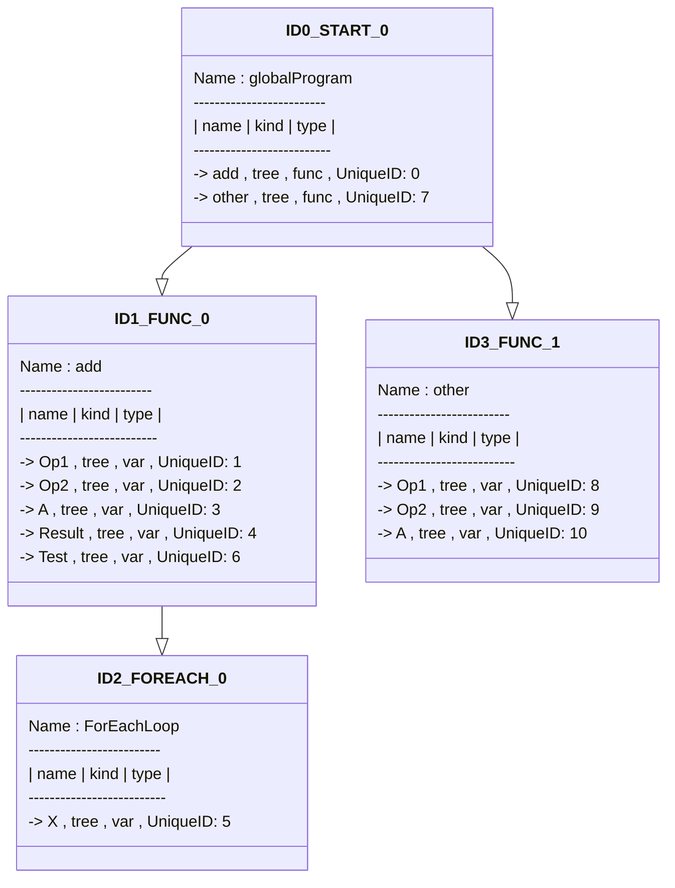

```mermaid
classDiagram 
class ID0_START_0{
   Name : globalProgram
   -------------------------
   | name | kind | type |
   --------------------------
   ->   add , tree , func , UniqueID: 0

   ->   other , tree , func , UniqueID: 7

}

class ID1_FUNC_0{
   Name : add
   -------------------------
   | name | kind | type |
   --------------------------
   ->   Op1 , tree , var , UniqueID: 1

   ->   Op2 , tree , var , UniqueID: 2

   ->   A , tree , var , UniqueID: 3

   ->   Result , tree , var , UniqueID: 4

   ->   Test , tree , var , UniqueID: 6

}

class ID2_FOREACH_0{
   Name : ForEachLoop
   -------------------------
   | name | kind | type |
   --------------------------
   ->   X , tree , var , UniqueID: 5

}

class ID3_FUNC_1{
   Name : other
   -------------------------
   | name | kind | type |
   --------------------------
   ->   Op1 , tree , var , UniqueID: 8

   ->   Op2 , tree , var , UniqueID: 9

   ->   A , tree , var , UniqueID: 10

}

ID0_START_0 --|> ID1_FUNC_0

ID1_FUNC_0 --|> ID2_FOREACH_0

ID0_START_0 --|> ID3_FUNC_1

```
