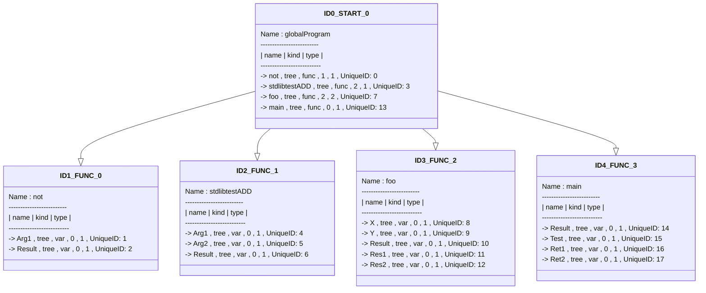

```mermaid
classDiagram 
class ID0_START_0{
   Name : globalProgram
   -------------------------
   | name | kind | type |
   --------------------------
   ->   not , tree , func , 1 , 1 , UniqueID: 0

   ->   stdlibtestADD , tree , func , 2 , 1 , UniqueID: 3

   ->   foo , tree , func , 2 , 2 , UniqueID: 7

   ->   main , tree , func , 0 , 1 , UniqueID: 13

}

class ID1_FUNC_0{
   Name : not
   -------------------------
   | name | kind | type |
   --------------------------
   ->   Arg1 , tree , var , 0 , 1 , UniqueID: 1

   ->   Result , tree , var , 0 , 1 , UniqueID: 2

}

class ID2_FUNC_1{
   Name : stdlibtestADD
   -------------------------
   | name | kind | type |
   --------------------------
   ->   Arg1 , tree , var , 0 , 1 , UniqueID: 4

   ->   Arg2 , tree , var , 0 , 1 , UniqueID: 5

   ->   Result , tree , var , 0 , 1 , UniqueID: 6

}

class ID3_FUNC_2{
   Name : foo
   -------------------------
   | name | kind | type |
   --------------------------
   ->   X , tree , var , 0 , 1 , UniqueID: 8

   ->   Y , tree , var , 0 , 1 , UniqueID: 9

   ->   Result , tree , var , 0 , 1 , UniqueID: 10

   ->   Res1 , tree , var , 0 , 1 , UniqueID: 11

   ->   Res2 , tree , var , 0 , 1 , UniqueID: 12

}

class ID4_FUNC_3{
   Name : main
   -------------------------
   | name | kind | type |
   --------------------------
   ->   Result , tree , var , 0 , 1 , UniqueID: 14

   ->   Test , tree , var , 0 , 1 , UniqueID: 15

   ->   Ret1 , tree , var , 0 , 1 , UniqueID: 16

   ->   Ret2 , tree , var , 0 , 1 , UniqueID: 17

}

ID0_START_0 --|> ID1_FUNC_0

ID0_START_0 --|> ID2_FUNC_1

ID0_START_0 --|> ID3_FUNC_2

ID0_START_0 --|> ID4_FUNC_3

```
