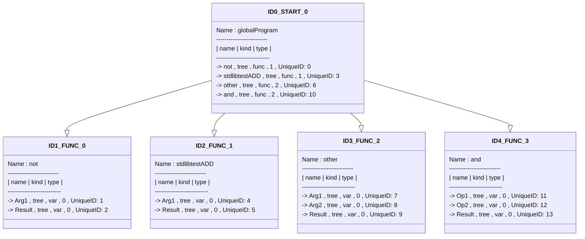

```mermaid
classDiagram 
class ID0_START_0{
   Name : globalProgram
   -------------------------
   | name | kind | type |
   --------------------------
   ->   not , tree , func , 1 , UniqueID: 0

   ->   stdlibtestADD , tree , func , 1 , UniqueID: 3

   ->   other , tree , func , 2 , UniqueID: 6

   ->   and , tree , func , 2 , UniqueID: 10

}

class ID1_FUNC_0{
   Name : not
   -------------------------
   | name | kind | type |
   --------------------------
   ->   Arg1 , tree , var , 0 , UniqueID: 1

   ->   Result , tree , var , 0 , UniqueID: 2

}

class ID2_FUNC_1{
   Name : stdlibtestADD
   -------------------------
   | name | kind | type |
   --------------------------
   ->   Arg1 , tree , var , 0 , UniqueID: 4

   ->   Result , tree , var , 0 , UniqueID: 5

}

class ID3_FUNC_2{
   Name : other
   -------------------------
   | name | kind | type |
   --------------------------
   ->   Arg1 , tree , var , 0 , UniqueID: 7

   ->   Arg2 , tree , var , 0 , UniqueID: 8

   ->   Result , tree , var , 0 , UniqueID: 9

}

class ID4_FUNC_3{
   Name : and
   -------------------------
   | name | kind | type |
   --------------------------
   ->   Op1 , tree , var , 0 , UniqueID: 11

   ->   Op2 , tree , var , 0 , UniqueID: 12

   ->   Result , tree , var , 0 , UniqueID: 13

}

ID0_START_0 --|> ID1_FUNC_0

ID0_START_0 --|> ID2_FUNC_1

ID0_START_0 --|> ID3_FUNC_2

ID0_START_0 --|> ID4_FUNC_3

```
